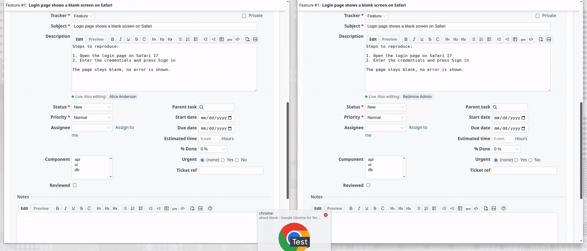

# Redmine Realtime Editor [](https://github.com/jperelli/redmine_realtime_editor/actions/workflows/test.yml) [](LICENSE)

[](doc/demo.mp4)

*Two users on the same issue: the description is typed in one browser and appears in the other with the author's caret, fields flip with a "changed by" mark (including through Redmine's own form refresh on status change), and both submit without a conflict. Click the image for the video.*

**Google-Docs style co-editing of issues, comments and wiki pages, with no extra infrastructure.** When two people open the same issue form, every keystroke in the description shows up in the other browser within a second, both texts converge (Yjs CRDT, no "last write wins"), you see the other editors' carets and selections in their own colour with their name, and a small bar under the textarea shows who else is editing and who is typing. Every other field of the form (status, assignee, dates, custom fields...) follows too: change the priority and the other editors' selects flip with a "changed by Alice" mark. Saving works exactly as before: Redmine's form, permissions, journals and history are untouched.

The difference with [redmine_yjs](https://www.redmine.org/plugins/redmine_yjs) is the transport. That plugin needs a separate websocket server (Node/y-websocket) next to Redmine, a port, a reverse proxy rule, TLS, process supervision... This plugin talks to **Redmine itself over plain HTTP polling** (optionally long polling). Install the plugin, restart Redmine, done. It works behind any reverse proxy, on shared hosts, and wherever you cannot open ports or run extra daemons.

- Shared text: issue description, issue notes (new comment), editing an existing comment, wiki pages (including section editing).
- Shared issue fields: everything else in the issue edit form (tracker, subject, status, priority, assignee, parent, dates, estimated time, % done, private flag, custom fields, every select/checkbox/radio/text input). The native controls stay in place; a remote change is applied to them and marked "changed by Alice" for a few seconds. Redmine's own form refresh on status/tracker/project change keeps working and the shared values survive it.
- New comments are *private* by default (you only see that someone else is writing one); switch them to *shared* to co-write one comment. When somebody posts a shared comment the other editors get a banner naming them and their notes box is locked until they reload.
- Remote carets and selections drawn over the textarea, one colour per user, name label while they move. The textarea stays Redmine's own: toolbar, preview, attachments and drag-and-drop keep working.
- Presence bar: live/offline state, "Also editing: Alice, Bob", typing indicator.
- Shared drafts survive a page reload and are discarded a configurable time after everybody leaves.
- Saving from a co-edited issue form does **not** trigger Redmine's "updated by another user" conflict for the other editors: they already have every value that was saved. Changes made elsewhere (API, bulk edit, a form that does not share the fields) still do.
- No new permissions: you can co-edit exactly the fields you can already edit.
- No cron, no background job, no websocket, no extra process. Only three small tables.
- Redmine 5.1 to 7.0 (tested in CI), MIT license.

## How it works

Each browser tab runs a [Yjs](https://yjs.dev/) document bound to the textarea. Local edits become small binary updates that the tab POSTs to `/realtime_editor/sync`, a normal Redmine controller. The server does not understand Yjs: it authorizes the request with Redmine's own visibility/edit checks, appends the update to an ordered log for that document and returns every update the tab has not seen yet, plus who else is on the document. Tabs poll every second while somebody else is editing, every 3 seconds when alone, every 20 seconds in background tabs (all configurable). Because Yjs is a CRDT, updates can arrive in any order and every tab ends up with the same text.

The other issue fields share one more document per form: a Yjs map *field name => value* bound to the native inputs and selects of `#all_attributes`, last write wins per field. Writing a remote value into a control fires its `change` event, so Redmine's own behaviour (refreshing the form when status, tracker or project change) runs as if the user had picked it; the plugin re-applies the shared values once the refreshed form arrives.

The draft is transient: when the field is saved through Redmine's normal form, the text lands where it always did (issue, journal, wiki content) and the draft is reset or its version hint updated. The field map is dropped as soon as the issue changes without going through a collaborative form (API, bulk edit). Drafts nobody touches for 30 minutes (configurable) are discarded on the next request, so no cleanup task is needed.

### Long polling

By default the plugin uses plain polling: each request returns immediately. In *Administration > Plugins > Redmine Realtime Editor > Configure* you can set a *long polling hold* of up to 25 seconds: the server then keeps each poll open until a change arrives, which lowers latency and request count. Every waiting request occupies an application server thread (Puma ships with 5), so only enable it if your server has threads to spare.

## Installation

```bash
cd /path/to/redmine/plugins
git clone https://github.com/jperelli/redmine_realtime_editor.git
cd /path/to/redmine
bundle exec rake redmine:plugins:migrate RAILS_ENV=production
```

Restart Redmine. Open an issue in two browsers, click *Edit* in both and start typing.

The Yjs bundle is committed (`assets/javascripts/realtime_editor_yjs.js`), so **no Node.js is needed** to install or run the plugin. Node is only required if you want to rebuild it (see below).

### Uninstall

```bash
cd /path/to/redmine
bundle exec rake redmine:plugins:migrate NAME=redmine_realtime_editor VERSION=0 RAILS_ENV=production
rm -rf plugins/redmine_realtime_editor
```

## Settings

*Administration > Plugins > Redmine Realtime Editor > Configure*

| Setting | Default | Meaning |
| --- | --- | --- |
| Collaborative fields | all on | Which fields are shared: issue description, other issue fields, issue notes, editing a comment, wiki pages |
| New comments are | private | *Private*: each user writes their own comment, the others only see who is writing. *Shared*: everybody co-writes one comment, posted by whoever submits; the others are then locked out with a banner until they reload |
| Poll period with other editors | 1000 ms | How often a tab asks for changes while somebody else has the field open |
| Poll period when alone | 3000 ms | How often a tab checks whether somebody joined |
| Poll period in background tabs | 20000 ms | Keeps the draft alive while the tab is hidden |
| Long polling hold | 0 s (off) | Seconds the server keeps each poll open waiting for changes, max 25 |
| Draft lifetime | 30 min | A draft nobody has open for this long is discarded |
| Compact after | 200 | Stored changes after which a browser replaces the log with one merged snapshot |

## Development

Requirements: Docker and Docker Compose. Ruby is not needed on the host.

```bash
docker compose build
./provision.sh            # sqlite db, plugin migration, default data, project1, users alice/bob (password123)
docker compose up -d redmine
```

Redmine is at http://localhost:3000 (admin/admin). Open an issue as admin in one browser and as alice in a private window to see the synchronization.

The plugin directory is mounted into the container. Changes to views, assets and controllers are picked up on reload; changes to `init.rb` or `lib/` need `docker compose restart redmine`.

### Frontend

`frontend/` holds the esbuild setup that bundles Yjs into `assets/javascripts/realtime_editor_yjs.js`. The plugin's own client code is plain ES5 in `assets/javascripts/realtime_editor.js` and needs no build step.

```bash
cd frontend
npm ci
npm run build   # regenerates ../assets/javascripts/realtime_editor_yjs.js
npm test        # checks the committed bundle
```

CI fails if the committed bundle differs from a fresh build.

### Tests and lint

```bash
docker build -f Dockerfile.test -t redmine_realtime_editor-test .   # add --build-arg REDMINE_TAG=5.1-bookworm etc.
docker run --rm redmine_realtime_editor-test
docker run --rm -v "$PWD":/plugin -w /plugin ruby:3.4 sh -c 'gem install rubocop -v 1.81.1 --no-document && rubocop'
```

## Limitations

- The polling latency is the configured poll period (1 s by default), not the ~50 ms of a websocket. For co-editing text this is barely noticeable.
- Only `textarea` fields are shared. Redmine's other inputs (subject, status, custom fields) are not.
- Remote carets are refreshed with each poll, so they move in steps of the poll period rather than continuously.
- Each poll is a regular Redmine request. With N editors on a field that is N requests per second at the default settings; the requests are small and touch only the plugin tables.

## License

MIT, see [LICENSE](LICENSE).
